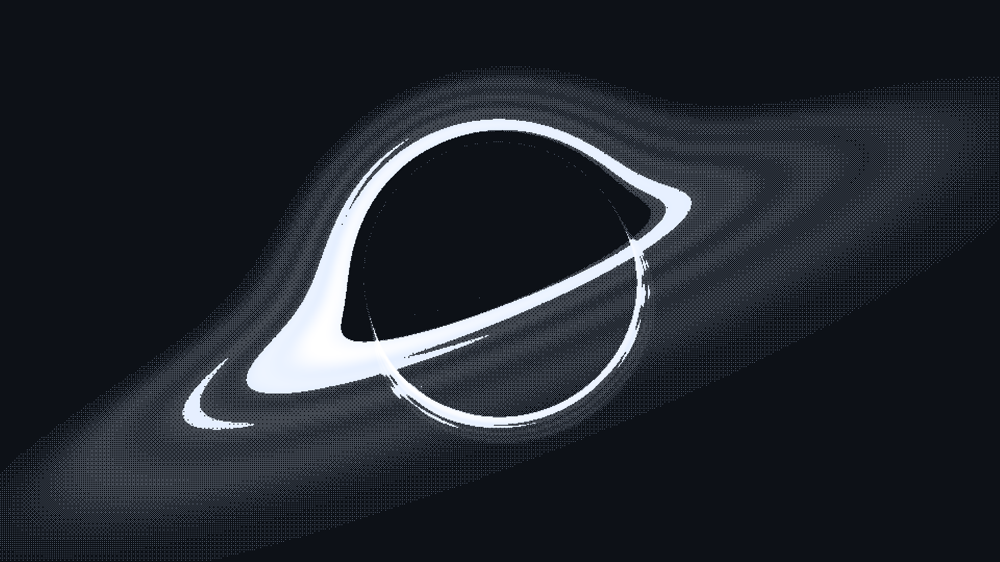

# Schwarzschild-style Black Hole Ray Tracer

A stylized C++20 ray tracer simulating light bending around a compact mass and a Keplerian accretion disk with relativistic Doppler shading, rendered via matrix dithering.

<p align="center">
  
</p>

---

## Overview

This project traces rays backward from a camera through a strong gravitational field, reproducing the visual signature of a black hole: a photon-sphere-like shadow and a lensed, Doppler-shaded accretion disk. It favors a **fast, visually convincing approximation** over a full general-relativistic integration — see "Physical Model" below for exactly what is and isn't implemented.

The output pipeline renders the accumulated radiance into a stylized, dithered matrix look tailored for dark environments (`#0d1117`).

---

## Physical Model

### 1. Light bending — pseudo-Newtonian approximation

Rays are **not** integrated as true null geodesics of the Schwarzschild metric. Instead, `GeodesicIntegrator` applies a Newtonian force derived from the **Paczyński–Wiita pseudo-potential**:

$$\Phi(r) = -\frac{M}{r - r_s}, \qquad r_s = 2M$$

$$\vec{a}(\vec{r}) = -\nabla\Phi = -\frac{M}{(r - r_s)^2}\,\hat{r}$$

integrated with a standard 4th-order Runge-Kutta scheme. This potential is a well-known trick for reproducing the correct **ISCO at $r = 6M$** for massive-particle orbits, and it gives a qualitatively black-hole-like deflection and shadow for rendering purposes. It is **not** the real photon geodesic equation, and it does not reproduce the exact GR light-bending angle or the true photon sphere dynamics at $r = 3M$. Treat the render as an artistic approximation, not a physically exact simulation.

- **Event horizon (cutoff):** $r_s = 2M$
- **Disk inner edge:** set to the ISCO of the pseudo-potential, $r = 6M$ (configurable)

### 2. Accretion disk — Doppler-shaded, hand-styled brightness

The disk crosses the equatorial plane $z=0$ between a configurable `rIn`/`rOut`. Its base brightness profile is **not derived from a physical emissivity law** (e.g. Shakura–Sunyaev or Novikov–Thorne); it's a hand-tuned sum of Gaussian rings chosen to look good (bright core near the inner edge, a few concentric bands, a fading outer tail). Treat it as a stylistic stand-in for a real emissivity profile.

What *is* physically modeled is the relativistic shading on top of that base brightness. The disk material moves at the Newtonian circular (Keplerian) speed:

$$v_\phi = \sqrt{\frac{M}{r}}$$

and each sample is shaded by the special-relativistic Doppler factor toward the camera:

$$g = \frac{1}{\gamma\,(1 - \vec{v}\cdot\vec{k})}\sqrt{1 - \frac{2M}{r}}, \qquad \gamma = \frac{1}{\sqrt{1-v^2}}$$

The final intensity uses an **artistic exponent**, not the physical bolometric beaming law ($I_\text{obs} \propto g^4 I_\text{em}$ for an ideal blackbody disk):

$$I_{\text{obs}} = I_{\text{base}} \cdot g^{1.35}$$

The lower exponent was chosen to keep the far (redshifted) side of the disk visible rather than crushing it to black, at the cost of physical accuracy.

### 3. Rendering pipeline
- Fixed-step RK4 backward ray marching from the camera, one ray per pixel (OpenMP-parallelized over rows).
- Rays are stopped at the horizon cutoff ($r \le 1.008\,r_s$) or once they escape past $r = 48M$.
- Disk contribution is accumulated by sampling every plane crossing along each ray.
- Output is tone-mapped (gamma + boost), then dithered with Floyd–Steinberg and written out as a `#0d1117`-styled PPM/PNG.

---

## Project Structure

```text
.
├── CMakeLists.txt
├── include/
│   ├── AccretionDisk.hpp
│   ├── Dither.hpp
│   ├── Font8x8.hpp
│   ├── Geodesic.hpp
│   └── Vec3.hpp
└── src/
    ├── AccretionDisk.cpp
    ├── Dither.cpp
    ├── Geodesic.cpp
    └── main.cpp
```

---

## Build & Usage

### Prerequisites
- C++20 compliant compiler (`gcc >= 11` or `clang >= 13`)
- CMake >= 3.20
- OpenMP (optional, enables CPU multithreading if found)
- FFmpeg (optional — only needed for the `render` target's automatic PPM → PNG conversion)

### Build with CMake

```bash
mkdir build && cd build
cmake -DCMAKE_BUILD_TYPE=Release ..
cmake --build .
```

This produces the `blackhole_tracer` executable, which writes `blackhole.ppm` when run:

```bash
./blackhole_tracer
```

If FFmpeg is found on your system, an additional `render` target is generated that runs the tracer and converts the output to PNG in one step:

```bash
cmake --build . --target render
```

Without FFmpeg, convert `blackhole.ppm` to PNG with any tool you like, e.g.:

```bash
ffmpeg -y -i blackhole.ppm blackhole.png
# or, with Python/Pillow:
python3 -c "from PIL import Image; Image.open('blackhole.ppm').save('blackhole.png')"
```

> Note: there is no Makefile in this project — only CMake is supported.

---

## Configuration

Camera perspective, inclination angle, step size, and disk radii can be adjusted directly in `src/main.cpp`:

```cpp
constexpr int WIDTH = 1920;
constexpr int HEIGHT = 1080;
constexpr double FOV = 0.58;

Vec3 camPos(0.0, -36.0, 6.2);
constexpr double tiltAngle = -0.38; // Inclination angle
```

---

## Validation & Benchmarks

### Theoretical Framework

In Schwarzschild spacetime ($G = c = 1$, $M = 1$), the radial equation governing equatorial null geodesics ($\theta = \pi/2$) is parameterized by the impact parameter $b \equiv L/E$:

$$\left(\frac{dr}{d\lambda}\right)^2 = \frac{1}{b^2} - V_{\text{eff}}(r) \quad \text{where} \quad V_{\text{eff}}(r) = \frac{1}{r^2}\left(1 - \frac{2M}{r}\right)$$

* **Critical impact parameter**: The effective potential attains its maximum at the photon sphere $r_{\text{ph}} = 3M$, defining the capture threshold:
  $$b_c = 3\sqrt{3}M \approx 5.196152\,M$$
* **Plunge regime ($b < b_c$)**: Photons overcome the centrifugal barrier and cross the event horizon ($r \to 2M$).
* **Scattering regime ($b > b_c$)**: Photons reach an exact turning point $r_{\text{min}}$ (periastron), derived as the physical root of $1/b^2 - V_{\text{eff}}(r) = 0$, before escaping to infinity.

### Methodology & GYOTO Cross-Validation

The benchmark suite (`benchmarks/validate_benchmark.py`) solves the formal elliptic integrals via numerical quadrature (`scipy.integrate.quad` / `scipy.optimize.brentq`). This methodology serves as the gold-standard benchmark established by **Vincent et al. (2011)** for the validation of the relativistic ray-tracing code **GYOTO** (*Observatoire de Paris / LUTH / IAP*).

Numerical integration results from the C++ Runge-Kutta 4th-order solver:

| Impact Parameter $b/M$ | Theoretical Regime | RK4 Numerical State | Theoretical $r_{\text{min}}$ | Numerical $r_{\text{min}}$ | Relative Error |
| :--- | :--- | :--- | :--- | :--- | :--- |
| `4.50` | Plunge | Captured ($r \to 2M$) | $2.0000\,M$ | $2.0000\,M$ | Conforme |
| `5.00` | Plunge | Captured ($r \to 2M$) | $2.0000\,M$ | $2.0000\,M$ | Conforme |
| `5.15` | Critical Plunge | Captured ($r \to 2M$) | $2.0000\,M$ | $2.0000\,M$ | Conforme |
| `5.20` | Critical Scattering | Deflected | $3.0687\,M$ | $3.2556\,M$ | $6.09 \times 10^{-2}$ |
| `6.00` | Scattering | Deflected | $4.4534\,M$ | $4.5419\,M$ | $1.99 \times 10^{-2}$ |
| `10.00` | Asymptotic Weak Field | Deflected | $8.7889\,M$ | $8.9597\,M$ | $1.94 \times 10^{-2}$ |

*Note on residual discrepancies:* The $\sim 2\%$ relative difference in the deflected regime stems from the Paczyński-Wiita pseudo-Newtonian potential formulation used for the acceleration field compared to full general-relativistic Christoffel symbols, alongside fixed step-size effects during turning-point integration.

### Reproducing the Benchmark

To execute the automated validation suite:

```bash
python benchmarks/validate_benchmark.py
```

## License

This project is open-source under the MIT License.
